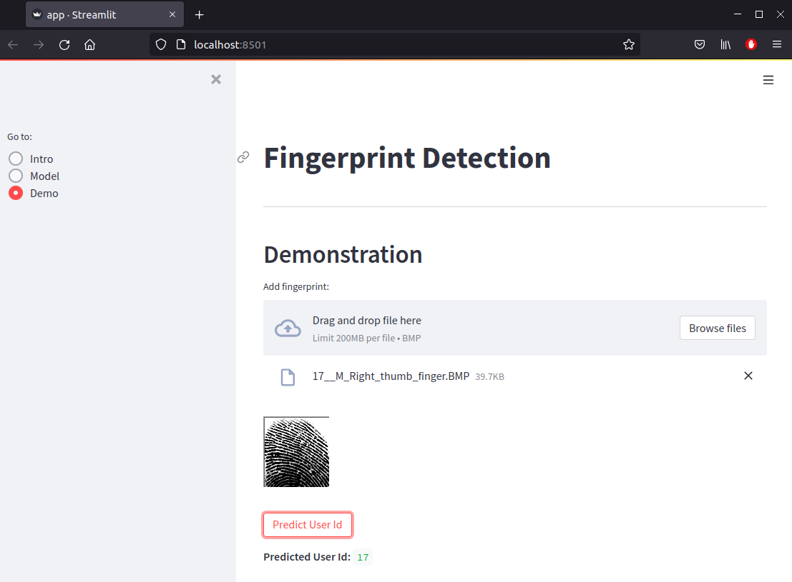

# Fingerprint Detection

## Project
In this project, we are going to be working with Convolutional Neural Networks for fingerprint detection.

The dataset used in this project is the Sokoto Coventry Fingerprint Dataset ([SOCOFing](https://www.kaggle.com/ruizgara/socofing)), which is a biometric fingerprint database designed for academic research purposes. SOCOFing is made up of 6,000 fingerprint images from 600 African subjects and contains unique attributes such as labels for gender, hand and finger name as well as synthetically altered versions with three different levels of alteration for obliteration, central rotation, and z-cut. 

## Development Steps

1. Implement a Convolutional Neural Network (CNN) for fingerprint detection;
2. Train and evaluate the model using the modified fingerprints (Altered dataset);
3. Test the model on real fingerprints (raw dataset - unmodified fingerprints);
4. Export the classification model and create an dashboard for demonstration.

## Technologies
The following technologies were used in this project:

* Python
* Numpy
* OpenCV
* Matplotlib
* Seaborn
* Tensorflow
* Scikit-learn

## File Organization

    .
    ├── assets/         # Project assets                                           
    ├── dashboard/      # Streamlit dashboard
    |   ├── pages/       
    |   └── app.py                               
    ├── data/              
    |   └── SOCOFing/   # Sokoto Coventry Fingerprint Dataset
    ├── src/
    |   ├── models/     # Trained models
    |   └── *.ipynb     # Documented development notebooks
    └── README.md       # Documentation

## Dashboard demo

